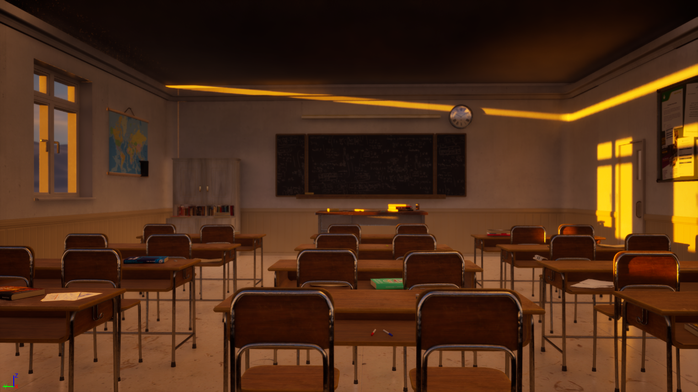
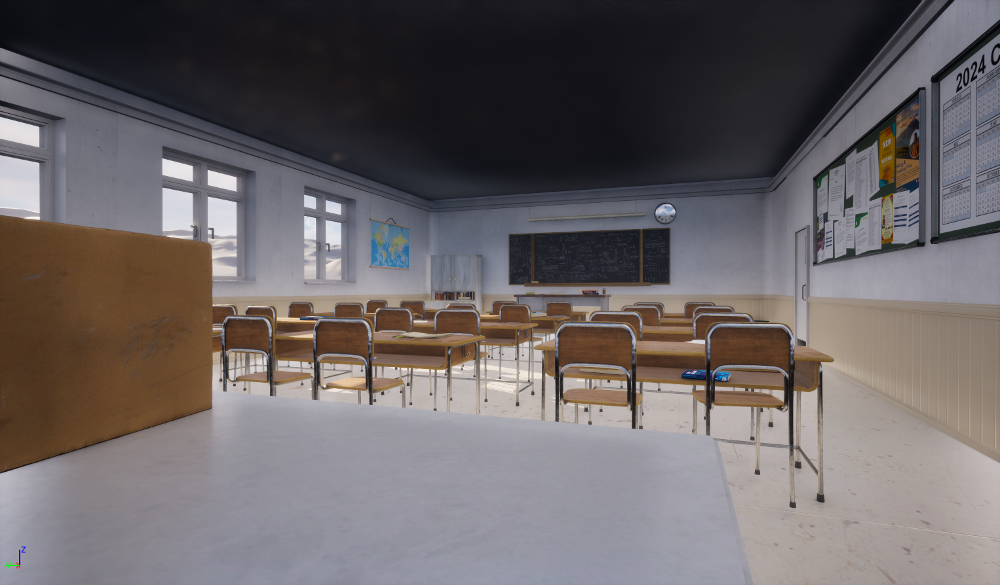

# Classroom Scene - Unreal Engine 5

## Overview  
This project is a realistic classroom scene created using **Blender**, **Adobe Substance Painter**, and **Unreal Engine 5**. The environment includes detailed 3D assets, realistic textures, and optimized lighting to achieve a high-quality render in UE5.  

## Features  
- Modeled in **Blender** with accurate scale and proportions  
- Textured in **Adobe Substance Painter** using PBR workflow  
- Imported and assembled in **Unreal Engine 5**  
- Realistic lighting setup for enhanced visual quality  
- Organized asset hierarchy for easy modification  

## Tools & Software  
- **Blender** – 3D Modeling  
- **Adobe Substance Painter** – Texture Painting  
- **Unreal Engine 5** – Scene Assembly & Rendering  

## Screenshots  

🔗 Full project source files (unreal file) available here: https://drive.google.com/file/d/1srD6hBi4mD-LZedei-EGukk1mpAoBi2S/view

